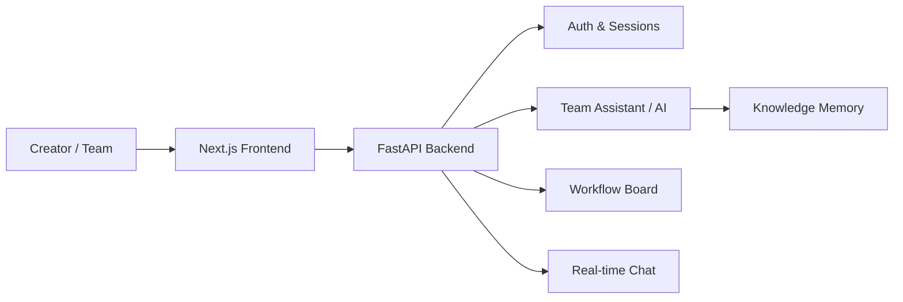

# Agentic Trend Orchestrator

[](https://project-l0sn8.vercel.app)
[](LICENSE)
[]()
[]()

> An agentic AI platform for creators that automates trend discovery, predicts content performance via semantic analysis, and orchestrates team workflows through a persistent knowledge memory layer.

---

## Problem

Content teams juggle trend research, task coordination, and cross-channel communication across disconnected tools. There is no single workspace that combines AI-assisted planning with real-time collaboration.

## Solution

A full-stack web platform with session-guarded workspaces, an AI team assistant (notes → summary → tasks → reminders), workflow boards with milestones, and real-time chat (DMs, groups, join requests).



## Key Features

- Auth + session-guarded workspace access
- Team Assistant — notes, summaries, tasks, reminders
- Workflow management — board, stage moves, milestones, uploads
- Chat — DM, groups, join requests
- Deployed frontend on Vercel with CORS-aware API

## Tech Stack

| Layer | Tools |
|-------|-------|
| Frontend | Next.js, React, Tailwind, shadcn/ui |
| Backend | FastAPI, Python |
| Database | SQLAlchemy + Alembic migrations |
| Deploy | Vercel (frontend), Docker-ready backend |

## Project Structure

```
agentic-trend-orchestrator/
├── backend/          FastAPI app, routes, services, models
├── frontend/         Next.js web application
├── docs/             API contract, coverage matrix, progress
├── uploads/          Attachment files served by backend
└── logs/             API call logs
```

## Quick Start (Windows PowerShell)

1. Create and activate virtual environment:
   ```powershell
   python -m venv .venv
   .\.venv\Scripts\Activate.ps1
   pip install -r requirements.txt
   Copy-Item .env.example .env
   ```

2. Run backend:
   ```powershell
   python -m uvicorn backend.app.main:app --reload --host 127.0.0.1 --port 8000
   ```

3. Run frontend (separate terminal):
   ```powershell
   cd frontend
   npm install
   npm run dev
   ```
   Open `http://localhost:3000`

## Tests

```powershell
python -m pytest backend/tests
```

## Deploy

See [Deploy frontend on Vercel](#deploy-frontend-on-vercel-production--preview) in the original setup notes below.

### Deploy frontend on Vercel (Production + Preview)

1. Push this repository to GitHub.
2. In [Vercel](https://vercel.com/new), import the repo and set **Root Directory** to `frontend`.
3. Add `NEXT_PUBLIC_API_BASE_URL` (must end with `/api/v1`) for Production and Preview scopes.
4. On the FastAPI host, CORS allows `https://*.vercel.app` by default. Customize via `CORS_ORIGINS` in `.env`.

## Notes

- Auth users persist under `data/auth_store.json` (gitignored). Passwords are plaintext for local MVP only.
- API base URL defaults to `http://127.0.0.1:8000/api/v1`.
- Most `/api/v1` routes require `x-auth-token`.

## License

MIT — see [LICENSE](LICENSE).
