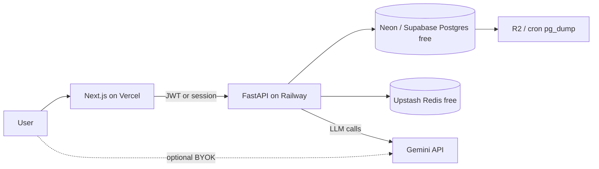

# Production Launch Guide

OAuth, data persistence, backups, and LLM cost control for **Vercel (frontend) + Railway (backend)** — tuned to this repo’s current stack.

## Current state (as of this doc)

| Area | Today | Risk |
|------|--------|------|
| Auth | Custom username/password, `x-auth-token`, `data/auth_store.json` | Plaintext passwords; not OAuth |
| Chat / workflow / team | In-memory dicts in route modules | **Lost on every Railway redeploy** |
| LLM | Single shared `GEMINI_API_KEY` in env | All users spend **your** quota |
| Token logging | `print` in `llm/core.py` only | No governance or per-user limits |
| Uploads | Local `uploads/` on Railway | Ephemeral disk without a volume |

---

## Target architecture (cheap + governable)



| Layer | Free / low-cost choice | Why |
|--------|-------------------------|-----|
| Auth + OAuth | **Clerk** (10k MAU free) or **Auth.js** + Google/GitHub | OAuth without building password flows |
| App data | **Neon** or **Supabase Postgres** (free tier) | Survives Railway restarts; enables usage quotas |
| Rate limits | **Upstash Redis** (free) | Per-user RPM / daily caps |
| Uploads | **Cloudflare R2** (10 GB free) or Railway Volume | Ephemeral disk on Railway is risky |
| Backups | `pg_dump` → R2 on a cron | ~$0 for small DBs |
| LLM cost to you | **BYOK** and/or hard per-user caps | Stops “my key, their usage” |

Keep Vercel + Railway; add **managed Postgres + optional Redis**, not a full platform migration.

---

## Railway Basic (implemented path)

This repo’s production stack uses **only Railway + Vercel** (no Neon/Redis/R2):

| Component | Implementation |
|-----------|----------------|
| Database | Railway **PostgreSQL** plugin → `DATABASE_URL` |
| Files | Railway **Volume** at `/data` → `UPLOAD_ROOT=/data/uploads` |
| Auth | **Auth.js** on Vercel + JWT verified on FastAPI (`AUTH_JWT_SECRET`) |
| LLM trial | Shared `GEMINI_API_KEY` + per-user monthly cap in Postgres |
| Backups | Cron runs [`scripts/backup_db.sh`](../scripts/backup_db.sh) → `/data/backups` |

See **[railway-deploy.md](./railway-deploy.md)** for env vars and deploy steps.

---

## 1. OAuth setup

### Option A — Clerk (fastest for a live demo)

1. Add Clerk to the Next.js app (`frontend/`).
2. Enable Google / GitHub in the Clerk dashboard.
3. Frontend sends `Authorization: Bearer <Clerk JWT>` to FastAPI.
4. Backend verifies JWT via Clerk JWKS (`PyJWT` + JWKS URL or `clerk-backend-api`).
5. Map `clerk_user_id` → internal `user_id` in Postgres.

| | |
|---|---|
| **Cost** | $0 until ~10k MAU |
| **Tradeoff** | Vendor lock-in; minimal backend auth code |

### Option B — Auth.js (NextAuth v5) on Vercel

1. OAuth with **Google** (free for login).
2. Issue session JWT or use DB sessions.
3. FastAPI validates the same JWT (shared secret or public key).

| | |
|---|---|
| **Cost** | $0 |
| **Tradeoff** | You wire JWT validation and user sync |

### Option C — Supabase Auth

OAuth + Postgres in one product. Good if app data already lives on Supabase.

| | |
|---|---|
| **Cost** | Free tier sufficient for try-outs |

### Recommendation

- **Ship quickly:** Clerk.
- **Long-term $0 at scale:** Auth.js + Postgres `users` table.

**Do not** ship plaintext passwords to production. Replace `x-auth-token` from `auth_store.json` with verified OAuth JWTs.

---

## 2. Data persistence (required before public launch)

Workflow, chat, and team data are in-memory today — they **reset on deploy**.

### Step 1 — Postgres

**Free:** [Neon](https://neon.tech), [Supabase](https://supabase.com)  
**Paid (~$5/mo):** Railway Postgres (simplest ops with Railway backend)

**Minimal tables:**

- `users`
- `sessions` (if not fully delegated to Clerk)
- `workflow_items`, `milestones`
- `chat_messages`, `groups`
- `team_tasks`, `summaries`
- `uploads` (metadata only; blobs in R2)

### Step 2 — Uploads

Do not rely on Railway local `uploads/` alone.

- **Cloudflare R2** — S3-compatible, cheap egress
- **Supabase Storage** — free tier

### Step 3 — Environment split

| Environment | API | DB | LLM |
|-------------|-----|-----|-----|
| Production | Railway prod | Neon prod | Real quotas / BYOK |
| Preview (Vercel PRs) | Railway staging | Neon branch | `LLM_GLOBAL_DISABLED` or test keys |

Set `CORS_ORIGINS` / `CORS_ALLOW_VERCEL` per [`.env.example`](../.env.example).

---

## 3. Data backup (low cost)

| Method | Cost | Notes |
|--------|------|--------|
| Neon free | $0 | Manual export; limited PITR on free |
| Daily `pg_dump` → Cloudflare R2 | ~$0 | GitHub Action or Railway cron |
| Supabase Pro | Paid | Built-in daily backups |

**Suggested cron:** nightly `pg_dump | gzip` → R2; retain 7 daily + 4 weekly.

```bash
# Example (run from CI with DATABASE_URL secret)
pg_dump "$DATABASE_URL" | gzip > backup-$(date +%F).sql.gz
# upload to R2 via aws-cli compatible tool
```

---

## 4. Stop burning your Gemini tokens

### Model 1 — BYOK (bring your own key) — $0 for you

- Settings UI: user pastes their `GEMINI_API_KEY`.
- Encrypt at rest (`ENCRYPTION_KEY` + Fernet, or Postgres extensions).
- Resolve key in `load_llm_config()`: per-user key → else block LLM routes.
- Same pattern for `OPENAI_API_KEY` on trend analytics if exposed publicly.

| Pros | Cons |
|------|------|
| You pay $0 for inference | Friction for non-technical users |

### Model 2 — Platform key + strict quotas — smooth onboarding

- One `GEMINI_API_KEY` for a “trial” tier.
- Check quota **before** every call in `llm/core.py`.
- Log `usageMetadata` to Postgres after each call.

| Pros | Cons |
|------|------|
| Easy try-out | You pay; must cap aggressively |

### Model 3 — Invite-only / waitlist

- Clerk allowlist or `invites` table.
- Combine with daily token budget.

### Model 4 — Free-tier-friendly models

- Default **Gemma 4** (`gemma-4-31b-it`) and `GEMINI_FALLBACK_MODELS` (e.g. `gemma-4-26b-a4b-it`; see `.env.example`).
- Set **GCP / Google AI billing budgets and alerts**.
- Gate **trend analytics** (Whisper + GPT-4o) behind BYOK or admin-only.

### Recommended beta mix

1. Signup → **BYOK required** for AI **or** small shared trial (e.g. 100k tokens/month/user).
2. Non-AI features (workflow, chat without “Ask AI”) work without any LLM key.
3. Kill switch: `LLM_GLOBAL_DISABLED=true` in Railway.

---

## 5. Token usage tracking and limits

### Table: `llm_usage_events`

```sql
CREATE TABLE llm_usage_events (
  id            UUID PRIMARY KEY DEFAULT gen_random_uuid(),
  user_id       TEXT NOT NULL,
  feature       TEXT NOT NULL,  -- chat | team | workflow | task_extract
  model         TEXT NOT NULL,
  prompt_tokens INT NOT NULL DEFAULT 0,
  output_tokens INT NOT NULL DEFAULT 0,
  total_tokens  INT NOT NULL DEFAULT 0,
  estimated_usd NUMERIC(10, 6),
  created_at    TIMESTAMPTZ NOT NULL DEFAULT now()
);
```

### Table: `user_llm_quota`

```sql
CREATE TABLE user_llm_quota (
  user_id              TEXT PRIMARY KEY,
  period_start         DATE NOT NULL,  -- first day of month
  token_budget         BIGINT NOT NULL,
  tokens_used          BIGINT NOT NULL DEFAULT 0,
  max_requests_per_day INT NOT NULL DEFAULT 50,
  requests_today       INT NOT NULL DEFAULT 0,
  requests_day         DATE
);
```

### Enforcement flow (`call_llm_guarded(user_id, feature, ...)`)

1. Load quota for user (+ optional global daily cap).
2. If `tokens_used >= token_budget` → `429` with a clear message.
3. Call existing Gemini logic in `backend/app/llm/core.py`.
4. On success: insert `llm_usage_events`, increment `tokens_used`.
5. Optional: **Upstash** sliding window — e.g. max 10 LLM calls/minute/user.

### Admin / alerts

- `GET /api/v1/admin/usage` (admin role or secret header).
- Webhook when global usage > 80% of monthly budget.
- GCP budget alert on the Gemini project.

### Starting quotas

| Tier | Monthly tokens | Notes |
|------|----------------|--------|
| Trial (your key) | 100k–500k | ~50–200 short chats |
| BYOK | Unlimited (their bill) | You log for UX only |
| Anonymous | 0 | Require login |

---

## 6. Hosting cost snapshot

| Service | Typical cost |
|---------|----------------|
| Vercel Hobby | $0 |
| Railway Hobby + small DB | $5–15/mo |
| Neon / Supabase DB | $0 (free tier) |
| Clerk | $0 (<10k MAU) |
| Upstash Redis | $0 |
| R2 backups | <$1/mo |
| **Your LLM** | **$0 with BYOK**; else hard **$20/mo** GCP cap |

---

## 7. Phased rollout

| Phase | Work | Outcome |
|-------|------|---------|
| **0** | Postgres + persist workflow/chat/team | Data survives deploys |
| **1** | Clerk or Auth.js; JWT on API | OAuth; no plaintext passwords |
| **2** | `llm_usage_events` + quota in `core.py` | Track and limit usage |
| **3** | BYOK settings page | You stop paying for heavy users |
| **4** | R2 uploads + nightly `pg_dump` | Backup story |
| **5** | Staging Railway + Neon branch for Vercel Preview | Safe PR demos |

---

## 8. Product copy for a public try-out

1. **Landing:** “Sign in with Google → connect your Gemini key (optional 7-day trial with ours).”
2. **Feature flags:** Team Assistant, task extraction, chat AI behind `has_llm_access`.
3. **Terms:** Trial inference uses Google Gemini; usage capped per account.
4. **Abuse:** Cloudflare in front of Vercel (free); rate-limit `/auth/*`.

---

## 9. What not to do

- Do not expose a shared `GEMINI_API_KEY` to unlimited signups without quotas.
- Do not depend on Railway filesystem for `data/auth_store.json` and `uploads/` without a volume or object storage.
- Do not store user API keys in plaintext.
- Do not expose trend ingest (OpenAI-heavy) on the free path until BYOK or strict caps exist.

---

## 10. Env vars to add (reference)

```env
# Database
DATABASE_URL=postgresql://...

# Auth (Clerk example)
CLERK_SECRET_KEY=
CLERK_JWKS_URL=

# LLM governance
LLM_GLOBAL_DISABLED=false
LLM_DEFAULT_MONTHLY_TOKEN_BUDGET=200000
ENCRYPTION_KEY=  # for BYOK at rest

# Object storage (R2)
S3_ENDPOINT=
S3_ACCESS_KEY_ID=
S3_SECRET_ACCESS_KEY=
S3_BUCKET=

# Rate limiting (Upstash)
UPSTASH_REDIS_REST_URL=
UPSTASH_REDIS_REST_TOKEN=
```

---

## Next implementation PR (suggested scope)

1. Postgres + SQLAlchemy/asyncpg models; migrate in-memory stores.
2. `llm_usage_events` + `call_llm_guarded` wrapper.
3. Clerk on `frontend/` + JWT middleware on FastAPI.
4. BYOK settings API + encrypted storage.

Choose before building:

- **Auth:** Clerk vs Auth.js vs Supabase
- **Beta LLM:** BYOK-only vs small shared trial
