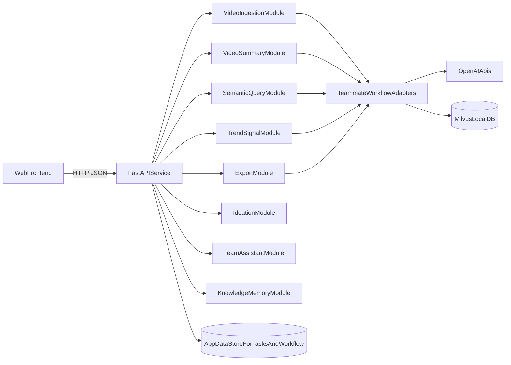

# Web MVP Integration Plan

Build a web-only MVP with auth, Team Assistant, Workflow, and Chat as the first complete user flow, then integrate ingest/query/trend adapters incrementally.

## Todo Table
| ID | Task | Status |
| --- | --- | --- |
| `init-structure` | Create monorepo structure (`backend`, `frontend`, `docs`) and baseline app skeleton. | `done` |
| `teammate-mapping` | Map external workflow modules (`ingest.py`, `query.py`, `summarize.py`, `trend.py`, `export.py`) into adapter interfaces. | `pending` |
| `api-doc-foundation` | Create and maintain `docs/api-contract.md` and `docs/api-coverage-matrix.md`. | `done` |
| `backend-api-first` | Implement initial API set with auth guard and modular routes. | `done` |
| `feature-endpoints` | Add Team, Workflow, Chat, and auth endpoints for first web flow. | `done` |
| `web-ui-mvp` | Build web screens wired to Team/Workflow/Chat APIs. | `done` |
| `validation-tests` | Add schema validation, smoke tests, and update docs as features progress. | `in_progress` |
| `team-assistant-mvp` | Build Team Assistant logic + API + page (summary, tasks, reminders, logs). | `done` |
| `workflow-milestones-mvp` | Build Workflow logic + API + page (`Idea -> Brief -> Production -> Review -> Publish`). | `done` |
| `chat-mvp` | Add auth-protected DM/group chat endpoints + chat page. | `done` |
| `ingest-query-trend-adapters` | Wire teammate pipeline modules through backend APIs. | `pending` |
| `delivery-tracker` | Keep progress docs updated for build, enhance, and not-started items. | `in_progress` |

## Assumptions
- Backend stack: Python + FastAPI (best fit for teammate Python modules).
- Teammate repo is the primary backend logic source for trend detection workflows.
- Scope is web interface only (no Android integration).

## Current Codebase Reality
- This repo now includes an active FastAPI backend and Next.js frontend with shipped Team/Workflow/Chat modules.
- Correct teammate repo already implements core creator workflows via CLI commands in [C:/Users/SUDHENDU BASU/OneDrive/Documents/Shamik/Coding/Hackathon/trend-detection-content-workflow/run.py](C:/Users/SUDHENDU BASU/OneDrive/Documents/Shamik/Coding/Hackathon/trend-detection-content-workflow/run.py)
- Core reusable modules and capabilities:
  - Video ingestion pipeline (ffmpeg + Whisper + GPT-4o + embeddings + Milvus): [C:/Users/SUDHENDU BASU/OneDrive/Documents/Shamik/Coding/Hackathon/trend-detection-content-workflow/ingest.py](C:/Users/SUDHENDU BASU/OneDrive/Documents/Shamik/Coding/Hackathon/trend-detection-content-workflow/ingest.py)
  - Video summarization + niche/topic detection: [C:/Users/SUDHENDU BASU/OneDrive/Documents/Shamik/Coding/Hackathon/trend-detection-content-workflow/summarize.py](C:/Users/SUDHENDU BASU/OneDrive/Documents/Shamik/Coding/Hackathon/trend-detection-content-workflow/summarize.py)
  - Semantic Q&A over videos: [C:/Users/SUDHENDU BASU/OneDrive/Documents/Shamik/Coding/Hackathon/trend-detection-content-workflow/query.py](C:/Users/SUDHENDU BASU/OneDrive/Documents/Shamik/Coding/Hackathon/trend-detection-content-workflow/query.py)
  - Trend clustering + content brief generation: [C:/Users/SUDHENDU BASU/OneDrive/Documents/Shamik/Coding/Hackathon/trend-detection-content-workflow/trend.py](C:/Users/SUDHENDU BASU/OneDrive/Documents/Shamik/Coding/Hackathon/trend-detection-content-workflow/trend.py)
  - Milvus schema/upsert helpers: [C:/Users/SUDHENDU BASU/OneDrive/Documents/Shamik/Coding/Hackathon/trend-detection-content-workflow/db.py](C:/Users/SUDHENDU BASU/OneDrive/Documents/Shamik/Coding/Hackathon/trend-detection-content-workflow/db.py)
  - Export/report pipeline: [C:/Users/SUDHENDU BASU/OneDrive/Documents/Shamik/Coding/Hackathon/trend-detection-content-workflow/export.py](C:/Users/SUDHENDU BASU/OneDrive/Documents/Shamik/Coding/Hackathon/trend-detection-content-workflow/export.py)

## MVP Architecture (Web-Only)

## Repository Setup Plan
- Initialize monorepo structure in your current repo:
  - `backend/` (FastAPI services + adapters)
  - `frontend/` (web UI)
  - `docs/` (API contracts, integration status, feature map)
- Add teammate repo as a local dependency source via an adapter layer (import module functions, do not shell out to CLI from routes).
- Create explicit service boundaries so future mobile clients can reuse the same backend APIs later.

## Backend Plan (FastAPI)
- Build API modules by product feature:
  - `ingest`: upload/ingest videos and return `file_id` + processing status
  - `summary`: return video summaries and niche/topic metadata
  - `query`: semantic Q&A globally or scoped to one `file_id`
  - `trend`: trend clusters + generated briefs for niche
  - `export`: downloadable CSV of summarized dataset
  - `ideation`: optional wrapper over trend/query outputs for idea generation
  - `team`: task extraction / assignment / milestone endpoints
  - `workflow`: kanban stage transitions and approval states
  - `memory`: content/project history persistence and retrieval
- Add `adapters/teammate_workflow/` to wrap existing teammate functions with safe I/O and timeouts.
- Add async job handling for long-running model calls (queue + job status endpoint).
- Add health checks for API + OpenAI key presence + Milvus connectivity.

## Current Priority Modules
### 1) AI Team Assistant (Shipped, now enhancing)
- Primary outcomes:
  - Summarize chat/meeting notes.
  - Extract actionable tasks.
  - Assign owners.
  - Track and remind deadlines.
- Current implementation:
  - summarization + extraction + reminders APIs
  - `POST /api/v1/team/process` unified endpoint
  - logs API and frontend task/logs tabs
  - move-selected-task into workflow item flow in UI

### 2) Workflow & Milestones (Shipped, now enhancing)
- Primary outcomes:
  - Move work through stages: `Idea -> Brief -> Production -> Review -> Publish`.
  - Track milestone status and ownership.
  - Enforce transition rules and approval states.
- Current implementation:
  - work item CRUD APIs
  - stage transition + validation API
  - milestone create/update APIs
  - attachment upload + static serving
  - workflow activity logs API + dashboard/logs/edit UI

### 3) Auth + Chat (Shipped)
- Registration/login/me APIs
- token guard middleware over protected `/api/v1` routes
- DM + group chat APIs (search, join requests, admin approvals, messaging)
- frontend login panel, home auth-aware view, and chat inbox page

## API Documentation Strategy (Living Contract)
Create and maintain two docs under `docs/`:
- `docs/api-contract.md`
  - Canonical endpoint list, request schema, response schema, error model.
  - Include versioning and deprecation notes.
- `docs/api-coverage-matrix.md`
  - Track each endpoint with status: `exists_in_teammate`, `wrapped`, `new_required`, `in_progress`, `done`.
  - Map each endpoint to product feature (Ingest, Summary, Query, Trend, Export, Ideation, Team, Workflow, Memory).

Suggested section format for each endpoint in `api-contract.md`:
- Endpoint ID
- Method + Path
- Purpose
- Request params/body
- Response fields
- Validation rules
- Example request/response
- Status tag (`existing`, `new`, `planned`)

## Documentation Update Rules (Always On)
- For every new endpoint:
  1. Add/modify endpoint contract in `docs/api-contract.md`.
  2. Add/update status row in `docs/api-coverage-matrix.md`.
  3. Mark module progress in `docs/progress-tracker.md`.
- Use status values in progress tracker:
  - `not_started`
  - `building`
  - `enhancing`
  - `blocked`
  - `done`
- If a feature is invented during development, add it immediately as:
  - new endpoint in API contract,
  - new row in coverage matrix,
  - new line in progress tracker with rationale.

## Frontend Plan (Web Interface)
- Completed pages:
  - Home dashboard (`/`) with module cards and auth-aware state
  - Team assistant workspace (`/team`)
  - Workflow board (`/workflow`)
  - Chat inbox (`/chat`)
- API clients are wired for Team, Workflow, and Chat flows.
- Next pages to build after adapter integration:
  - ingest/upload, summary explorer, query/ideation, trend dashboard, memory/history.

## Incremental Delivery Phases
1. **Foundation**: repo scaffold, backend skeleton, docs skeleton, health endpoint. (`done`)
2. **Core creator flows**: auth + team + workflow + chat APIs and pages. (`done`)
3. **Adapter integration**: teammate ingest/summary/query/trend wrappers + async job APIs. (`next`)
4. **Expanded frontend**: trend/query/ideation/memory pages. (`next`)
5. **Hardening**: persistence, tests, validation, and demo scenarios. (`ongoing`)

## Risks and Mitigations
- **External dependency failures**: add retries/timeouts around OpenAI calls and explicit error surface in API responses.
- **Long inference runtime**: async job queue + polling endpoints + cached results.
- **Changing endpoint requirements**: enforce docs-first updates in `api-contract.md` before implementation.
- **Data inconsistency**: add strict pydantic request/response schemas across modules and stable `file_id`/job-id lifecycles.
