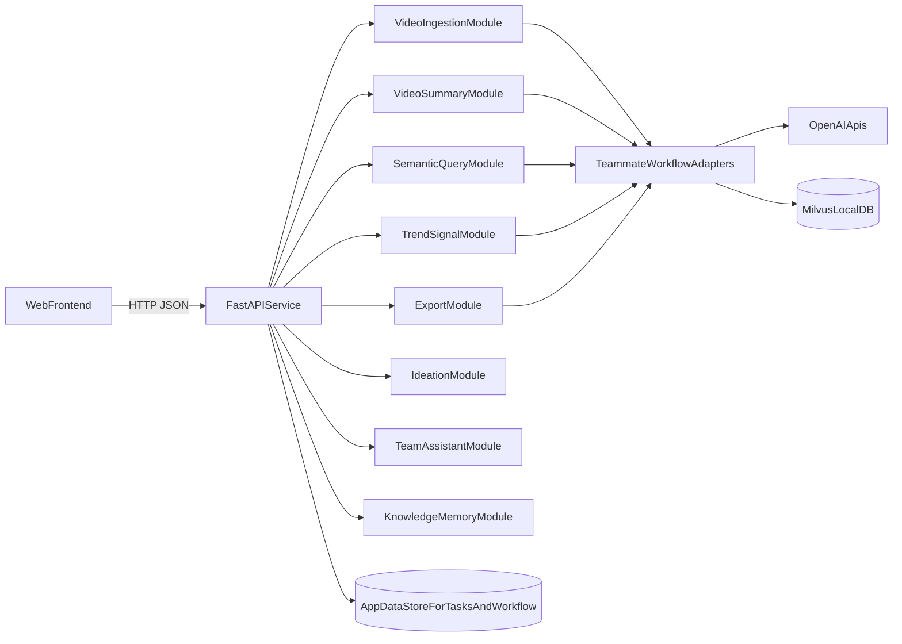

# Web MVP Integration Plan

Build a web-only MVP with standalone Team Assistant and Workflow modules first, then integrate supporting layers incrementally.

## Todo Table
| ID | Task | Status |
| --- | --- | --- |
| `init-structure` | Create monorepo structure (`backend`, `frontend`, `docs`) and baseline app skeleton. | `done` |
| `teammate-mapping` | Map external workflow modules (`ingest.py`, `query.py`, `summarize.py`, `trend.py`, `export.py`) into adapter interfaces. | `pending` |
| `api-doc-foundation` | Create and maintain `docs/api-contract.md` and `docs/api-coverage-matrix.md`. | `in_progress` |
| `backend-api-first` | Implement initial API set with async job status handling. | `pending` |
| `feature-endpoints` | Add Trend, Ideation, Team, Workflow, and Memory endpoint stubs. | `pending` |
| `web-ui-mvp` | Build web screens wired to module outputs and backend APIs. | `pending` |
| `validation-tests` | Add schema validation, smoke tests, and update docs as features progress. | `in_progress` |
| `team-assistant-mvp` | Build standalone Team Assistant logic (summarize, extract tasks, assign owners, reminders). | `in_progress` |
| `workflow-milestones-mvp` | Build standalone Workflow & Milestones logic (`Idea -> Brief -> Production -> Review -> Publish`). | `in_progress` |
| `delivery-tracker` | Keep progress docs updated for build, enhance, and not-started items. | `in_progress` |

## Assumptions
- Backend stack: Python + FastAPI (best fit for teammate Python modules).
- Teammate repo is the primary backend logic source for trend detection workflows.
- Scope is web interface only (no Android integration).

## Current Codebase Reality
- Your current repo is effectively a blank slate (`LICENSE` only): [C:/Users/SUDHENDU BASU/OneDrive/Documents/Shamik/Coding/Hackathon/agentic-trend-orchestrator/LICENSE](C:/Users/SUDHENDU BASU/OneDrive/Documents/Shamik/Coding/Hackathon/agentic-trend-orchestrator/LICENSE)
- Correct teammate repo already implements core creator workflows via CLI commands in [C:/Users/SUDHENDU BASU/OneDrive/Documents/Shamik/Coding/Hackathon/trend-detection-content-workflow/run.py](C:/Users/SUDHENDU BASU/OneDrive/Documents/Shamik/Coding/Hackathon/trend-detection-content-workflow/run.py)
- Core reusable modules and capabilities:
  - Video ingestion pipeline (ffmpeg + Whisper + GPT-4o + embeddings + Milvus): [C:/Users/SUDHENDU BASU/OneDrive/Documents/Shamik/Coding/Hackathon/trend-detection-content-workflow/ingest.py](C:/Users/SUDHENDU BASU/OneDrive/Documents/Shamik/Coding/Hackathon/trend-detection-content-workflow/ingest.py)
  - Video summarization + niche/topic detection: [C:/Users/SUDHENDU BASU/OneDrive/Documents/Shamik/Coding/Hackathon/trend-detection-content-workflow/summarize.py](C:/Users/SUDHENDU BASU/OneDrive/Documents/Shamik/Coding/Hackathon/trend-detection-content-workflow/summarize.py)
  - Semantic Q&A over videos: [C:/Users/SUDHENDU BASU/OneDrive/Documents/Shamik/Coding/Hackathon/trend-detection-content-workflow/query.py](C:/Users/SUDHENDU BASU/OneDrive/Documents/Shamik/Coding/Hackathon/trend-detection-content-workflow/query.py)
  - Trend clustering + content brief generation: [C:/Users/SUDHENDU BASU/OneDrive/Documents/Shamik/Coding/Hackathon/trend-detection-content-workflow/trend.py](C:/Users/SUDHENDU BASU/OneDrive/Documents/Shamik/Coding/Hackathon/trend-detection-content-workflow/trend.py)
  - Milvus schema/upsert helpers: [C:/Users/SUDHENDU BASU/OneDrive/Documents/Shamik/Coding/Hackathon/trend-detection-content-workflow/db.py](C:/Users/SUDHENDU BASU/OneDrive/Documents/Shamik/Coding/Hackathon/trend-detection-content-workflow/db.py)
  - Export/report pipeline: [C:/Users/SUDHENDU BASU/OneDrive/Documents/Shamik/Coding/Hackathon/trend-detection-content-workflow/export.py](C:/Users/SUDHENDU BASU/OneDrive/Documents/Shamik/Coding/Hackathon/trend-detection-content-workflow/export.py)

## MVP Architecture (Web-Only)

## Repository Setup Plan
- Initialize monorepo structure in your current repo:
  - `backend/` (FastAPI services + adapters)
  - `frontend/` (web UI)
  - `docs/` (API contracts, integration status, feature map)
- Add teammate repo as a local dependency source via an adapter layer (import module functions, do not shell out to CLI from routes).
- Create explicit service boundaries so future mobile clients can reuse the same backend APIs later.

## Backend Plan (FastAPI)
- Build API modules by product feature:
  - `ingest`: upload/ingest videos and return `file_id` + processing status
  - `summary`: return video summaries and niche/topic metadata
  - `query`: semantic Q&A globally or scoped to one `file_id`
  - `trend`: trend clusters + generated briefs for niche
  - `export`: downloadable CSV of summarized dataset
  - `ideation`: optional wrapper over trend/query outputs for idea generation
  - `team`: task extraction / assignment / milestone endpoints
  - `workflow`: kanban stage transitions and approval states
  - `memory`: content/project history persistence and retrieval
- Add `adapters/teammate_workflow/` to wrap existing teammate functions with safe I/O and timeouts.
- Add async job handling for long-running model calls (queue + job status endpoint).
- Add health checks for API + OpenAI key presence + Milvus connectivity.

## Current Priority Modules
### 1) AI Team Assistant (Priority Now)
- Primary outcomes:
  - Summarize chat/meeting notes.
  - Extract actionable tasks.
  - Assign owners.
  - Track and remind deadlines.
- Initial implementation (current phase):
  - core summarization logic
  - core task extraction + owner assignment logic
  - core reminder generation logic
  - unit tests for module behavior

### 2) Workflow & Milestones (Priority Now)
- Primary outcomes:
  - Move work through stages: `Idea -> Brief -> Production -> Review -> Publish`.
  - Track milestone status and ownership.
  - Enforce transition rules and approval states.
- Initial implementation (current phase):
  - core workflow item creation logic
  - stage transition validation and move logic
  - milestone create/update logic
  - unit tests for transition and milestone behavior

## API Documentation Strategy (Living Contract)
Create and maintain two docs under `docs/`:
- `docs/api-contract.md`
  - Canonical endpoint list, request schema, response schema, error model.
  - Include versioning and deprecation notes.
- `docs/api-coverage-matrix.md`
  - Track each endpoint with status: `exists_in_teammate`, `wrapped`, `new_required`, `in_progress`, `done`.
  - Map each endpoint to product feature (Ingest, Summary, Query, Trend, Export, Ideation, Team, Workflow, Memory).

Suggested section format for each endpoint in `api-contract.md`:
- Endpoint ID
- Method + Path
- Purpose
- Request params/body
- Response fields
- Validation rules
- Example request/response
- Status tag (`existing`, `new`, `planned`)

## Documentation Update Rules (Always On)
- For every new endpoint:
  1. Add/modify endpoint contract in `docs/api-contract.md`.
  2. Add/update status row in `docs/api-coverage-matrix.md`.
  3. Mark module progress in `docs/progress-tracker.md`.
- Use status values in progress tracker:
  - `not_started`
  - `building`
  - `enhancing`
  - `blocked`
  - `done`
- If a feature is invented during development, add it immediately as:
  - new endpoint in API contract,
  - new row in coverage matrix,
  - new line in progress tracker with rationale.

## Frontend Plan (Web Interface)
- Build web app against API-first contracts only (no direct model/script calls).
- Deliver web MVP pages:
  - Video ingestion/upload + processing status
  - Trend dashboard
  - Search/query + ideation workspace
  - Video summary explorer
  - Team task board + milestones
  - Knowledge history view
- Add API client module with typed request/response contracts matching `docs/api-contract.md`.
- Add status indicators for async jobs and model latency.

## Incremental Delivery Phases
1. **Foundation**: repo scaffold, backend skeleton, docs skeleton, health endpoint.
2. **First integration**: teammate ingest/summary/query/trend adapters + API wrappers + job status APIs.
3. **Core creator flows (current focus)**: team assistant + workflow/milestones standalone services.
4. **Frontend web MVP**: connect all pages to APIs with loading/error states.
5. **Hardening**: tests, validation, API contract updates, demo data.

## Risks and Mitigations
- **External dependency failures**: add retries/timeouts around OpenAI calls and explicit error surface in API responses.
- **Long inference runtime**: async job queue + polling endpoints + cached results.
- **Changing endpoint requirements**: enforce docs-first updates in `api-contract.md` before implementation.
- **Data inconsistency**: add strict pydantic request/response schemas across modules and stable `file_id`/job-id lifecycles.
